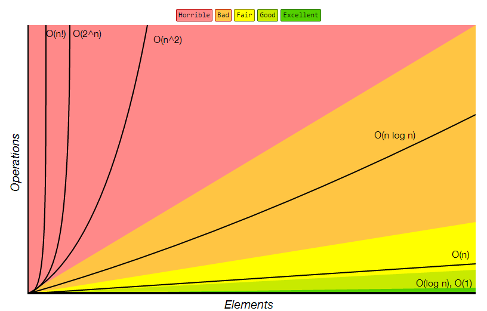

# Big-O Notation

Space and time complexity of an Algorithm.

Omega - Best Case Scenario  
Theta - Average Case Scenario  
O - Worst Case Scenario

### Vocabulary

**algorithm:** A sequence of steps that solves a problem.

**run time**: The amount of time it takes your computer to execute an algorithm written in a programming language like Javascript.

**size of the problem**: The variable n in an equation that describes the number of steps in an algorithm.

**big O notation**: A mathematical notation that describes how an algorithm’s time or space require-
ments increase as the size of n increases.

**order of magnitude**: A class in a classification system where each class is many times greater or
smaller than the one before.

**time complexity:** The maximum number of steps an algorithm takes to complete as n gets larger.

**constant time**: An algorithm runs in constant time when it requires the same number of steps
regardless of the problem’s size.

**logarithmic time**: An algorithm runs in logarithmic time when its run time grows in proportion to
the logarithm of the input size.

**linear time**: An algorithm runs in linear time when it grows at the same rate as the problem’s size.

**log-­linear time**: An algorithm runs in log-­linear time when it grows as a combination (multiplication) of logarithmic and linear time complexities.

**quadratic time**: An algorithm runs in quadratic time when its performance is directly proportional
to the square of the size of the problem.

**cubic time**: An algorithm runs in cubic time when its performance is directly proportional to the
cube of the size of the problem.

**polynomial time**: An algorithm runs in polynomial time when it scales as O(n\*\*a), where a = 2 for
quadratic time and a = 3 for cubic time.

**exponential time**: An algorithm runs in exponential time when it contains a constant raised to the
problem’s size.

**brute-­force algorithm**: A type of algorithm that tests every possible option.

#### Complexity Chart

